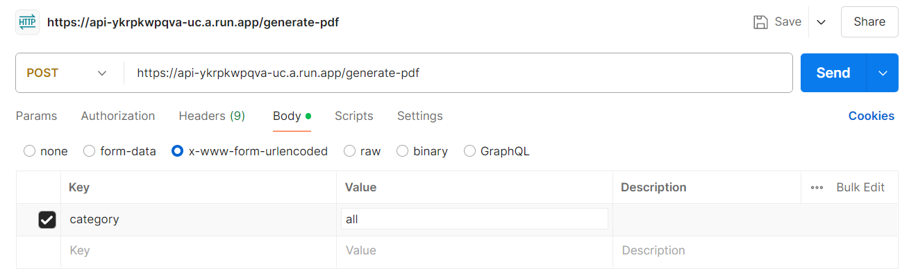

GET -Retrieve all expenses. : https://api-ykrpkwpqva-uc.a.run.app/expenses

POST -Add a new expense. : https://api-ykrpkwpqva-uc.a.run.app/expense

PUT Update an existing expense : https://api-ykrpkwpqva-uc.a.run.app/expense/:id

DEL Delete an expense.: https://api-ykrpkwpqva-uc.a.run.app/expense/:id

Signup New user :https://api-ykrpkwpqva-uc.a.run.app/expense/signup

POST-pdf generation : https://api-ykrpkwpqva-uc.a.run.app/generate-pdf

While Testing generate-pdf API kindly add value for the key "category" in Body section of POSTMAN

Value for category can be : "CASH","UPI","CHEQUE","NETBANKING","CREDIT CARD", "ALL",
